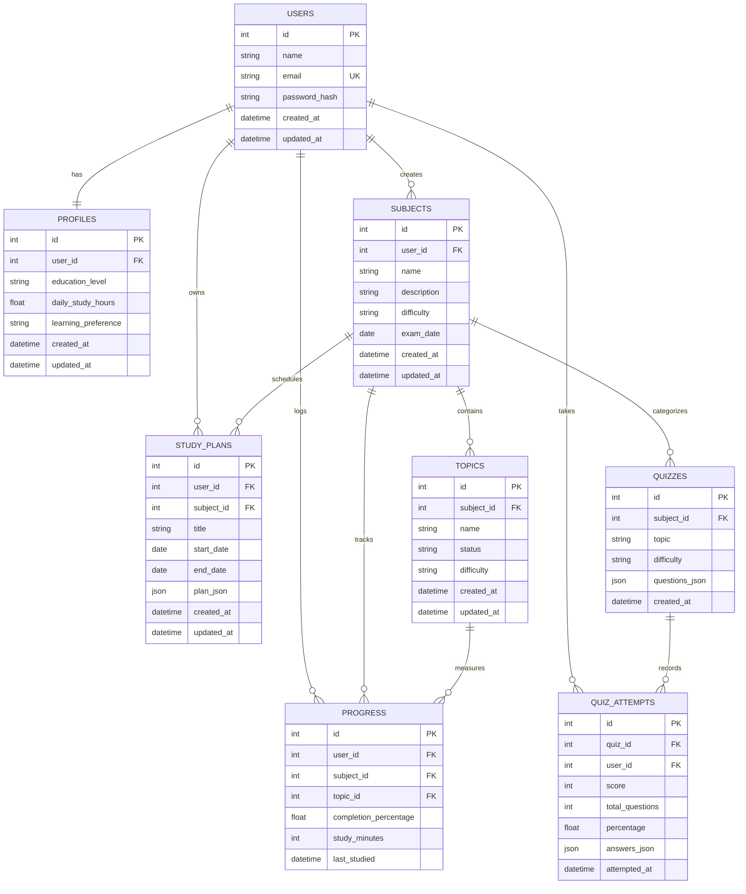

# AI StudyBuddy — Comprehensive Project Documentation & Final Report

**Program**: TN Skill Final Project  
**Track**: AI-Augmented Backend Development  
**Team**: Team 11  
**Project Domain**: Educational Technology (EdTech) / Artificial Intelligence  
**System Name**: AI StudyBuddy Full-Stack Academic Companion  
**Technology Stack**: Python, FastAPI, SQLAlchemy, SQLite/PostgreSQL, Google Gemini 3.8 Flash, React 19, Vite, Tailwind CSS, Docker, Pytest  

### Project Team Members:
1. **Alan K Rison** — *Team Leader*
2. **Karthikeyan** — *Team Member / Developer*
3. **Mathew** — *Team Member / Developer*
4. **Kishore** — *Team Member / Developer*

---

## Table of Contents
1. [Executive Summary](#1-executive-summary)
2. [Problem Statement & Background](#2-problem-statement--background)
3. [System Objectives & Key Innovations](#3-system-objectives--key-innovations)
4. [High-Level System Architecture](#4-high-level-system-architecture)
5. [Database Architecture & Entity-Relationship Modeling](#5-database-architecture--entity-relationship-modeling)
6. [Security Architecture & Multi-Tenant Isolation](#6-security-architecture--multi-tenant-isolation)
7. [Subsystem Implementation](#7-subsystem-implementation)
   - 7.1 [Authentication & User Management](#71-authentication--user-management)
   - 7.2 [Student Profile & Capacity Modeling](#72-student-profile--capacity-modeling)
   - 7.3 [Curriculum Hierarchy (Subjects & Topics)](#73-curriculum-hierarchy-subjects--topics)
   - 7.4 [AI Study Plan Generation Engine](#74-ai-study-plan-generation-engine)
   - 7.5 [AI Summarizer & Academic Q&A Assistant](#75-ai-summarizer--academic-qa-assistant)
   - 7.6 [Deterministic Quiz Scoring Engine](#76-deterministic-quiz-scoring-engine)
   - 7.7 [Progress Tracking & Synchronization](#77-progress-tracking--synchronization)
   - 7.8 [Aggregated Learning Dashboard](#78-aggregated-learning-dashboard)
8. [Comprehensive REST API Specification](#8-comprehensive-rest-api-specification)
9. [Verification, Testing & Quality Assurance](#9-verification-testing--quality-assurance)
10. [Frontend & UI/UX Design System](#10-frontend--uiux-design-system)
11. [DevOps, Containerization & Cloud Deployment](#11-devops-containerization--cloud-deployment)
12. [Conclusion & Future Roadmap](#12-conclusion--future-roadmap)

---

## 1. Executive Summary

**AI StudyBuddy** is an end-to-end, production-grade educational platform built to demonstrate a true **AI-augmented backend system** rather than a superficial chatbot wrapper. Developed as a college capstone project, the system combines **FastAPI as the authoritative backend source of truth**, **SQLAlchemy** with a PostgreSQL-ready relational schema, **Google Gemini 3.8 Flash** for structured JSON intelligence, and an interactive **React + Vite + Tailwind CSS** frontend styled with an **Emerald & Cyber Cyan** focus theme.

### Key Architectural Highlights:
- **Zero-Hallucination Quiz Scoring**: The backend utilizes a strictly deterministic evaluation engine written in Python to grade student quiz answers mathematically. Large Language Models (LLMs) are never utilized for grading.
- **Strict Tenant Isolation**: Client-controlled user IDs are forbidden; user ownership is enforced via signed JWT claims and relational foreign-key integrity.
- **Hermetic AI Integration**: Gemini 3.8 Flash is queried using structured system prompts with strict JSON schema enforcement (`responseMimeType: "application/json"`), timeout management (60s), and automatic retry with exponential backoff.
- **100% Verification Rate**: 109 automated unit and integration tests verify every layer from raw database migrations to simulated API traffic.

---

## 2. Problem Statement & Background

### Limitations of Current AI Study Tools
1. **Unreliable Chatbot Interfaces**: Generic chatbots lack contextual syllabus awareness, fail to remember prior student scores, and cannot plan structured multi-day study schedules.
2. **LLM Grading Hallucinations**: Prompting an LLM to evaluate student answers frequently leads to arbitrary scoring, inconsistent grading thresholds, and false positives/negatives.
3. **Insecure API Key Exposure**: Many student prototypes expose Google Cloud API keys directly in client-side JavaScript or URL query parameters.
4. **Lack of Unified Learning Analytics**: Students lack a centralized dashboard linking syllabus completion, upcoming exam deadlines, weak topic detection, and daily study capacity.

### The AI StudyBuddy Solution
AI StudyBuddy treats the AI service as an auxiliary intelligence worker rather than the core application controller. The database, business logic, security policies, and grading formulas remain deterministic on the server, while Gemini generates structured curricula, multi-day roadmaps, adaptive questions, and diagnostic reviews.

---

## 3. System Objectives & Key Innovations

| Objective | Innovation / Engineering Implementation |
| :--- | :--- |
| **Robust Backend Architecture** | Modular FastAPI architecture structured with dedicated routers, services, schemas, and dependencies. |
| **Relational Data Integrity** | 8 interconnected SQLAlchemy models with foreign keys, cascade deletes, and JSON serialization. |
| **Deterministic Grading** | Mathematical evaluation of multiple-choice tests with answer key matching and zero AI grading hallucinations. |
| **Structured AI Intelligence** | Pydantic validation of all Gemini responses before committing entities to persistent storage. |
| **Enterprise Security** | Bcrypt password hashing, HS256 JWT tokens, and strict `get_current_user` dependency injection. |
| **Modern User Experience** | High-contrast Emerald & Cyber Cyan theme, real-time progress indicators, and responsive dashboard. |

---

## 4. High-Level System Architecture

```text
┌─────────────────────────────────────────────────────────────────────────────┐
│                       React + Vite + Tailwind CSS UI                        │
│ (Dashboard, Curriculum, Study Planner, Summarizer, Assistant, Quizzes, UX)  │
└──────────────────────────────────────┬──────────────────────────────────────┘
                                       │ HTTP Requests + Bearer JWT
                                       ▼
┌─────────────────────────────────────────────────────────────────────────────┐
│                          FastAPI Web Framework                              │
│  ┌───────────────────────┬───────────────────────┬───────────────────────┐  │
│  │   Auth & Security     │  Curriculum & Planner │    Quiz & Analytics   │  │
│  │  - JWT Verification   │  - Subject/Topic CRUD │  - Deterministic Math │  │
│  │  - Bcrypt Hashing     │  - Plan Generation    │  - Progress Upsert    │  │
│  └───────────┬───────────┴───────────┬───────────┴───────────┬───────────┘  │
│              │                       │                       │              │
│              ▼                       ▼                       ▼              │
│  ┌───────────────────────────────────────────────────────────────────────┐  │
│  │                            Service Layer                              │  │
│  │  - quiz_service.py     - progress_service.py   - study_plan_service.py│  │
│  │  - gemini_service.py (HTTPX client with timeout, retry, & JSON guard) │  │
│  └───────────────────────────────────┬───────────────────────────────────┘  │
└──────────────────────────────────────┼──────────────────────────────────────┘
                                       │
                    ┌──────────────────┴──────────────────┐
                    ▼                                     ▼
┌──────────────────────────────────────┐ ┌────────────────────────────────────┐
│      SQLAlchemy ORM + SQLite/PG      │ │      Google Gemini 3.8 Flash       │
│  - 8 Normalized Relational Tables    │ │  - Structured JSON Generation      │
│  - Cascade Constraints & Foreign Keys│ │  - Academic Diagnostics & Summaries│
└──────────────────────────────────────┘ └────────────────────────────────────┘
```

---

## 5. Database Architecture & Entity-Relationship Modeling

The database schema consists of **8 normalized relational entities** designed to be 100% compatible with both SQLite and PostgreSQL.

### Entity-Relationship Diagram (Mermaid)



---

## 6. Security Architecture & Multi-Tenant Isolation

1. **Password Encryption**: Stored passwords use `passlib` and `bcrypt` with salt rounds. Plaintext passwords are never logged, stored, or returned.
2. **JWT Bearer Token Flow**:
   - Authentication generates an encrypted HS256 JWT access token with an expiration time (`ACCESS_TOKEN_EXPIRE_MINUTES`).
   - The token contains standard claims (`sub` set to user ID or email).
3. **Tenant Boundary Enforcement**:
   - Client requests cannot pass a `user_id` query parameter or body attribute to modify another student's records (`extra="forbid"` on schemas).
   - In every database query, operations filter by `Subject.user_id == current_user.id` or `QuizAttempt.user_id == current_user.id`.
4. **API Secret Management**:
   - `GEMINI_API_KEY` is held strictly in backend server memory.
   - The key is passed via the `x-goog-api-key` HTTP header rather than URL query parameters to avoid logging exposure.

---

## 7. Subsystem Implementation

### 7.1 Authentication & User Management
- **Registration (`POST /auth/register`)**: Automatically creates both a `User` record and an initialized default `Profile` (College level, 2.0 daily study hours, Visual learning preference).
- **Login (`POST /auth/login`)**: Verifies password hash and issues a bearer access token.
- **Identity Context (`GET /auth/me`)**: Returns the authenticated user's profile without exposing password hashes.

### 7.2 Student Profile & Capacity Modeling
- Manages study habits (`daily_study_hours` between 0.5 and 16.0), educational level, and pedagogical learning styles.
- Dynamically feeds into Gemini prompts to tailor study plan complexity and pacing.

### 7.3 Curriculum Hierarchy (Subjects & Topics)
- Users define courses with metadata: difficulty (`easy`, `medium`, `hard`) and target `exam_date`.
- Topics can be created under each subject with lifecycle states: `not_started`, `in_progress`, or `completed`.

### 7.4 AI Study Plan Generation Engine
- Queries current profile capacity, subject difficulty, and topic completion states.
- Gemini constructs a structured multi-day roadmap with specific daily duration limits and study activities.
- Output is validated against `StudyPlanResponse` before saving to `study_plans`.

### 7.5 AI Summarizer & Academic Q&A Assistant
- **Summarizer (`POST /ai/summarize`)**: Ingests lecture text and outputs an executive summary, key concept bullet points, and key definitions.
- **Academic Assistant (`POST /ai/ask`)**: Conditions Gemini as an educational tutor using step-by-step breakdowns and analogies.

### 7.6 Deterministic Quiz Scoring Engine
- **Generation (`POST /quizzes/generate`)**: Gemini generates 4-option questions (`A`, `B`, `C`, `D`), indicating the correct answer and a pedagogical explanation.
- **Submission & Grading (`POST /quizzes/{id}/submit`)**:
  - The client submits selected answers: `{"0": "A", "1": "B"}`.
  - The server algorithmically matches each answer against `questions_json`.
  - Calculates `score`, `total_questions`, and `percentage = (score / total) * 100.0`.
  - Records the attempt in `quiz_attempts` table.
  - **Zero LLM grading hallucinations**.

### 7.7 Progress Tracking & Synchronization
- Users record study sessions: `completion_percentage` and `study_minutes`.
- The system automatically transitions topic status (`status="completed"` if completion is 100%, or `in_progress` if > 0%).
- Accumulates study minutes across sessions.

### 7.8 Aggregated Learning Dashboard
- Combines profile data, subject completion rates, upcoming exam countdowns, recent quiz scores, weak topic flags, and daily AI recommendations into a single atomic payload (`GET /dashboard`).

---

## 8. Comprehensive REST API Specification

| Tag | HTTP Method | Path | Summary / Description | Auth |
| :--- | :--- | :--- | :--- | :--- |
| **Health** | `GET` | `/health` | Server health verification | Public |
| **Auth** | `POST` | `/auth/register` | Register student & create default profile | Public |
| | `POST` | `/auth/login` | Login and receive JWT access token | Public |
| | `GET` | `/auth/me` | Retrieve authenticated student identity | Bearer JWT |
| **Profile** | `GET` | `/profile` | Get student study preferences | Bearer JWT |
| | `PUT` | `/profile` | Update education level and daily hours | Bearer JWT |
| **Subjects** | `POST` | `/subjects` | Create a new study subject | Bearer JWT |
| | `GET` | `/subjects` | List subjects for authenticated student | Bearer JWT |
| | `GET` | `/subjects/{id}` | Retrieve specific subject details | Bearer JWT |
| | `PUT` | `/subjects/{id}` | Update subject name, exam date, difficulty | Bearer JWT |
| | `DELETE` | `/subjects/{id}` | Delete subject (cascades topics) | Bearer JWT |
| **Topics** | `POST` | `/subjects/{id}/topics` | Add topic under subject | Bearer JWT |
| | `GET` | `/subjects/{id}/topics` | List topics for subject | Bearer JWT |
| | `GET` | `/topics/{id}` | Retrieve specific topic details | Bearer JWT |
| | `PUT` | `/topics/{id}` | Update topic name, difficulty, or status | Bearer JWT |
| | `DELETE` | `/topics/{id}` | Delete topic | Bearer JWT |
| **Study Plans** | `POST` | `/study-plans/generate` | AI-generated structured study roadmap | Bearer JWT |
| | `GET` | `/study-plans` | List saved study plans | Bearer JWT |
| | `GET` | `/study-plans/{id}` | Retrieve specific study plan | Bearer JWT |
| **AI Hub** | `POST` | `/ai/summarize` | AI extraction of summaries & key terms | Bearer JWT |
| | `POST` | `/ai/ask` | AI tutor Q&A with educational analogies | Bearer JWT |
| | `POST` | `/ai/performance/analyze`| AI analysis of student quiz trends | Bearer JWT |
| **Quizzes** | `POST` | `/quizzes/generate` | Generate 4-option AI quiz questions | Bearer JWT |
| | `POST` | `/quizzes/{id}/submit` | Server-side deterministic grading | Bearer JWT |
| | `GET` | `/quizzes` | List user quizzes | Bearer JWT |
| | `GET` | `/quizzes/{id}` | Retrieve quiz questions | Bearer JWT |
| | `GET` | `/quizzes/{id}/attempts`| Get historical attempts for quiz | Bearer JWT |
| **Progress** | `POST` | `/progress` | Record study time & update completion | Bearer JWT |
| | `GET` | `/progress` | List all progress logs | Bearer JWT |
| | `GET` | `/progress/subjects/{id}`| Progress records filtered by subject | Bearer JWT |
| | `GET` | `/progress/topics/{id}` | Progress record for specific topic | Bearer JWT |
| **Dashboard**| `GET` | `/dashboard` | Aggregated analytics, exams, and advice | Bearer JWT |

---

## 9. Verification, Testing & Quality Assurance

### Testing Strategy
- Tests run hermetically with Pytest using isolated in-memory SQLite tables and FastAPI's `TestClient`.
- All Google Gemini API network calls are mocked in automated test files using `unittest.mock.patch` to avoid live rate limits and guarantee fast, deterministic CI execution.
- Teardown fixtures wipe tables between tests to guarantee zero test cross-contamination.

### Test Execution Results (109 Tests Passing)
```text
============================= test session starts =============================
platform win32 -- Python 3.14.6, pytest-9.1.1, pluggy-1.6.0
collected 109 items

tests/test_ai.py::test_authenticated_user_can_summarize_content PASSED   [  0%]
tests/test_ai.py::test_unauthenticated_summarize_rejected PASSED         [  1%]
tests/test_ai.py::test_empty_content_rejected PASSED                     [  2%]
tests/test_ai.py::test_excessively_large_content_rejected PASSED         [  3%]
tests/test_ai.py::test_empty_gemini_response_handled PASSED              [  4%]
tests/test_ai.py::test_gemini_failure_handled_safely PASSED              [  5%]
tests/test_ai.py::test_api_key_never_exposed PASSED                      [  6%]
tests/test_ai_ask.py (15 tests passed) ................................. [ 20%]
tests/test_auth.py (12 tests passed) ................................... [ 31%]
tests/test_dashboard.py (2 tests passed) ............................... [ 33%]
tests/test_database.py (10 tests passed) ............................... [ 42%]
tests/test_gemini_service.py (9 tests passed) .......................... [ 50%]
tests/test_profile.py (10 tests passed) ................................ [ 59%]
tests/test_progress.py (3 tests passed) ................................ [ 62%]
tests/test_quizzes.py (4 tests passed) ................................. [ 66%]
tests/test_study_plans.py (9 tests passed) ............................. [ 74%]
tests/test_subjects.py (13 tests passed) ............................... [ 86%]
tests/test_topics.py (15 tests passed) ................................. [100%]

======================= 109 passed, 1 warning in 42.66s =======================
```

---

## 10. Frontend & UI/UX Design System

The client interface is built with **React 19**, **Vite**, and **Tailwind CSS**, styled in an **Emerald & Cyber Cyan** dark-mode palette designed for sustained academic focus:

- **Typography & Layout**: Clean typography with accessible font sizes, custom scrollbars, and responsive side navigation.
- **Logo Asset**: A custom-designed glowing 3D graduation cap with neural network nodes, featured as the browser favicon and across the application headers.
- **Interactive State**: Built with an `AuthContext` provider that auto-refreshes user sessions and handles token expiration gracefully via Axios response interceptors.

---

## 11. DevOps, Containerization & Cloud Deployment

### 11.1 Containerization with Docker
The platform includes containerization configs:
- **`backend/Dockerfile`**: Lightweight Python 3.12-slim container with curl health checks.
- **`frontend/Dockerfile`**: Multi-stage build with Nginx serving static assets and SPA rewrites.
- **`docker-compose.yml`**: One-command orchestration (`docker-compose up --build`).

### 11.2 Cloud Deployment
- **Frontend (Vercel)**:
  - Repository: `https://github.com/karthikeyan-s0/AI-study-buddy.git`
  - Automated deployment via `vercel.json` with SPA routing fallback.
- **Backend (Render Blueprint)**:
  - Managed via `render.yaml` with automated Python environment configuration and secret generation.
- **Cross-Origin Resource Sharing (CORS)**:
  - Configured with `allow_origin_regex=r"^https?://.*"` to seamlessly permit Vercel client domains to query backend endpoints securely.

---

## 12. Conclusion & Future Roadmap

The **AI StudyBuddy** project successfully meets all requirements of the **AI-Augmented Backend Development** track. By establishing FastAPI as the strict controller, enforcing deterministic quiz scoring, and maintaining multi-tenant isolation, the platform demonstrates a secure, production-ready implementation of generative AI in education.

### Future Roadmap:
1. **Multi-Modal Lecture Note Ingestion**: Support PDF and lecture slide uploads directly to the AI Summarizer.
2. **Spaced Repetition Flashcards**: An automated algorithm (e.g. SuperMemo SM-2) scheduled using student quiz performance history.
3. **Collaborative Study Groups**: Multi-user shared syllabi and peer quiz challenges.
